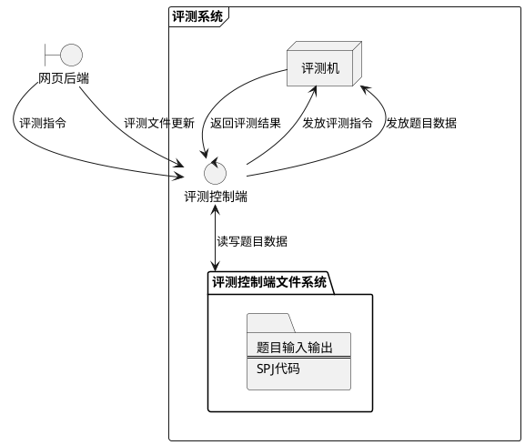
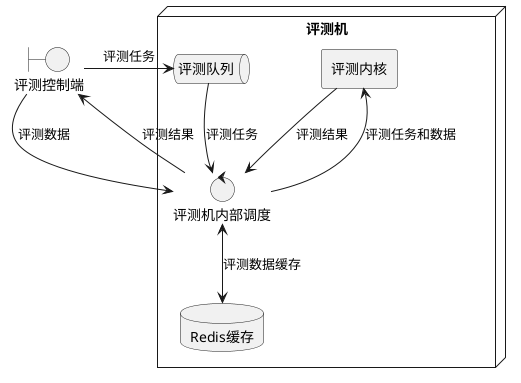
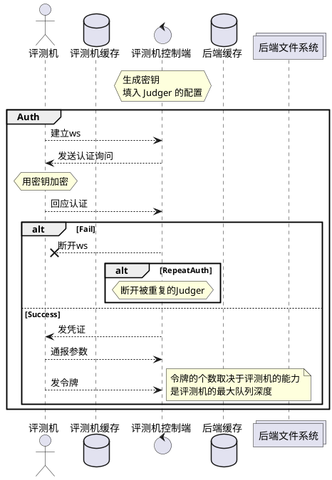
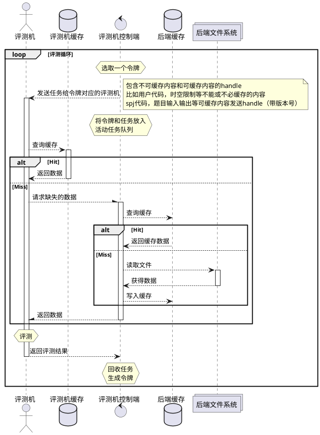
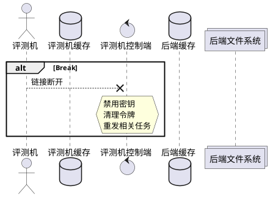
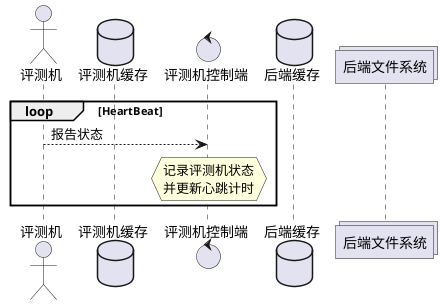

# 下一代评测机

## 总体

### 现有评测机

#### 现有评测机的优点

经过数代改进，现有的评测内核已经比较稳定，支持多种编程语言和SPJ。基本上满足OJ系统的需求。

#### 现有评测机的缺点

部署上与网页后端耦合，导致难以分离部署，难以引入多评测机机制。结果是在评测任务重时会抢占网站后端资源，导致网站陷入不能访问的局面。也难以拓展更高的评测性能。

### 计划做出的改进

#### 多评测机支持

采用 `C/S` 架构， `ws` 协议实现单控多评测机。

#### 与网页后端分离

评测客户端将只与评测控制端保持 `WebSocket` 连接。评测控制端与网页后端通过 `WebSocket` 交换评测指令，通过文件系统传递题目文件。

保持架构的相对独立，方便分离部署以及架设相关代理。

## 架构图

### 数据流图

#### 系统

#### 评测端

### 连接鉴权

### 评测循环

### 断联处理

### 心跳检测

