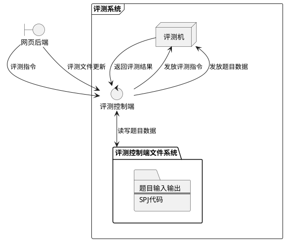
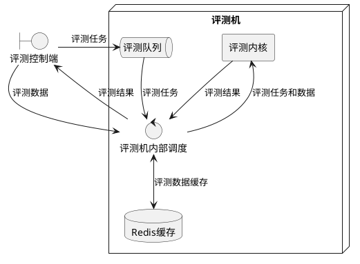

# 架构

本文以图片为主，描述了系统的总体架构

## 架构图

### 数据流图

#### 系统

```puml
@startuml
boundary "网页后端" as webbackend
frame "评测系统" {
  node "评测机" as judger
  control "评测控制端" as judgerbackend
  folder "评测控制端文件系统" as jbfs {
    folder 评测文件[
      题目输入输出
      ===
      SPJ代码
    ]
  }
}
webbackend --> judgerbackend : 评测指令
webbackend --> judgerbackend : 评测文件更新
judgerbackend <--> jbfs : 读写题目数据
judgerbackend --> judger : 发放评测指令
judgerbackend --> judger : 发放题目数据
judger --> judgerbackend : 返回评测结果
@enduml
```

#### 评测端

```puml
@startuml
boundary 评测控制端 as jb
node "评测机" as judger {
  agent 评测内核 as core
  control 评测机内部调度 as ctrl
  queue 评测队列 as que
  database Redis缓存 as rd
}
jb --> que : 评测任务
que --> ctrl : 评测任务
jb --> ctrl : 评测数据
ctrl <--> rd : 评测数据缓存
ctrl --> core : 评测任务和数据
core --> ctrl : 评测结果
ctrl --> jb : 评测结果
@enduml
```
