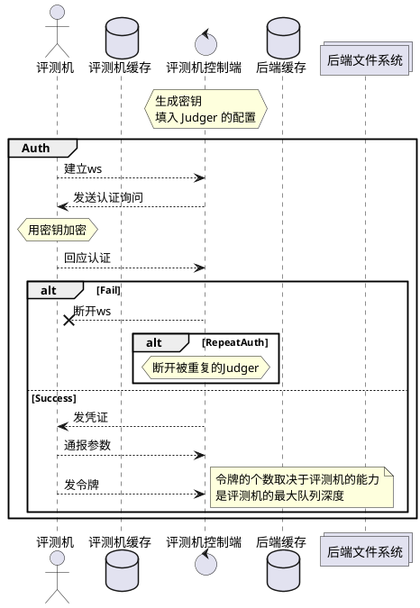
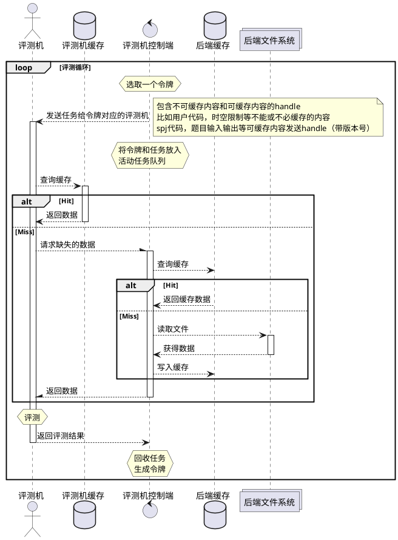
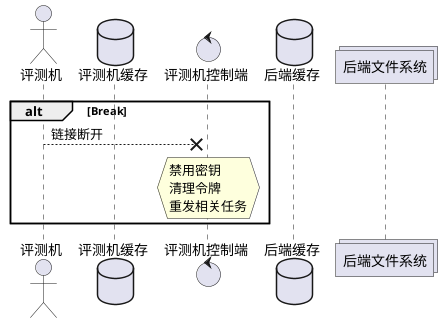
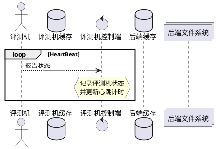

# 内部连接协议

## 时序图

### 连接鉴权

```puml
@startuml
scale 1
actor "评测机" as j
database "评测机缓存" as jb
control "评测机控制端" as b
database "后端缓存" as bb
collections "后端文件系统" as bfs
hnote over b : 生成密钥\n填入 Judger 的配置
group Auth
j --> b : 建立ws
b --> j : 发送认证询问
hnote over j : 用密钥加密
j --> b : 回应认证
alt Fail
b --x j : 断开ws
alt RepeatAuth
hnote over b : 断开被重复的Judger
end
else Success
b --> j : 发凭证
j --> b : 通报参数
j --> b : 发令牌
note right
令牌的个数取决于评测机的能力
是评测机的最大队列深度
endnote
end
end
@enduml
```

### 评测循环

```puml
@startuml
scale 1
actor "评测机" as j
database "评测机缓存" as jb
control "评测机控制端" as b
database "后端缓存" as bb
collections "后端文件系统" as bfs
loop 评测循环
hnote over b : 选取一个令牌
j <-- b : 发送任务给令牌对应的评测机
hnote over b : 将令牌和任务放入\n活动任务队列
activate j
note right
包含不可缓存内容和可缓存内容的handle
比如用户代码，时空限制等不能或不必缓存的内容
spj代码，题目输入输出等可缓存内容发送handle（带版本号）
endnote
j --> jb : 查询缓存
activate jb
alt Hit
jb --> j : 返回数据
deactivate jb
else Miss
j --\ b : 请求缺失的数据
activate b
b --> bb : 查询缓存
alt Hit
bb --> b : 返回缓存数据
else Miss
b --> bfs : 读取文件
activate bfs
bfs --> b : 获得数据
deactivate bfs
b --> bb : 写入缓存
end
b --\ j : 返回数据
deactivate b
end
hnote over j : 评测
j --> b : 返回评测结果
hnote over b : 回收任务\n生成令牌
deactivate j
end
@enduml
```

### 断联处理

```puml
@startuml
scale 1
actor "评测机" as j
database "评测机缓存" as jb
control "评测机控制端" as b
database "后端缓存" as bb
collections "后端文件系统" as bfs
alt Break
j --x b : 链接断开
hnote over b : 禁用密钥\n清理令牌\n重发相关任务
end
@enduml
```

### 心跳检测

```puml
@startuml
scale 1
actor "评测机" as j
database "评测机缓存" as jb
control "评测机控制端" as b
database "后端缓存" as bb
collections "后端文件系统" as bfs
loop HeartBeat
j --> b : 报告状态
hnote over b : 记录评测机状态\n并更新心跳计时
end
@enduml
```
